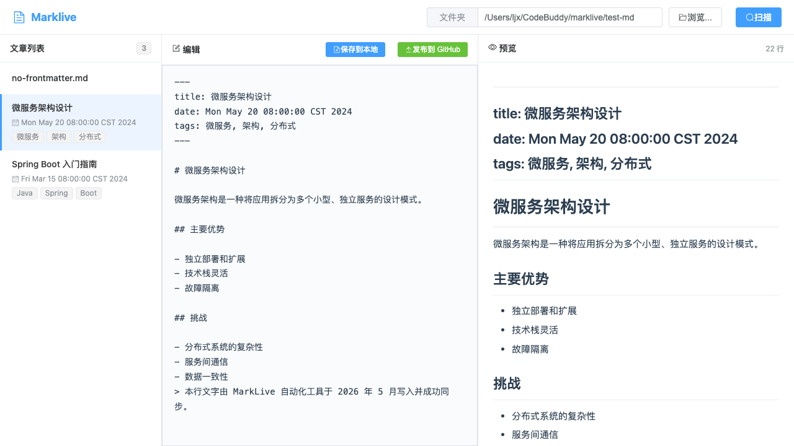

<div align="center">


</div>

<h1 align="center">📝 MarkLive</h1>

<p align="center">
  <em>Write locally. Preview instantly. Publish globally.</em>
</p>

<p align="center">
  <strong>一款专为极客和独立博客作者打造的本地 Markdown 实时预览与一键发布工具。</strong><br>
  可视化管理你的 Hexo / Hugo / VitePress 博客 —— 本地写稿，毫米级预览，一键上云。
</p>

---

<div align="center">
  
  <p><em>▲ MarkLive 三栏布局：文章列表 · 实时编辑 · 即时预览</em></p>
</div>

---

## 💡 这是什么？

**MarkLive** 是一个轻量级的 **Markdown 博客可视化外挂（CMS）**。

它不会帮你创建 Git 仓库，也不会重新发明静态站点生成器。它做的事情很简单：

> 在你已有的、绑定好 GitHub 远程仓库的博客目录之上，提供一套**丝滑的 GUI 操作界面**，让你告别命令行写稿的痛苦。

### ⚠️ 核心前提

本工具专用于管理 **已经初始化 Git 并成功绑定了 GitHub / Gitee 远程仓库** 的本地静态博客目录。

你的博客目录应该长这样：

```bash
my-blog/
├── .git/              # ← 必须！已经 git init 且绑定 remote
├── source/
│   └── _posts/
│       ├── hello-world.md
│       └── another-post.md
├── package.json       # 或 config.toml / _config.yml
└── ...
```

如果还没有博客，请先用 [Hexo](https://hexo.io/)、[Hugo](https://gohugo.io/) 或 [VitePress](https://vitepress.dev/) 初始化一个，并确保能成功 `git push`。

---

## ✨ 核心特性

<table>
  <tr>
    <td width="48px" align="center">📂</td>
    <td>
      <strong>智能目录识别</strong><br>
      通过后端原生弹窗（JFileChooser）一键浏览并选择本地博客目录，免去手动复制路径的痛苦。macOS 和 Windows 均适配系统原生文件对话框。
    </td>
  </tr>
  <tr>
    <td align="center">📝</td>
    <td>
      <strong>左树右编，实时预览</strong><br>
      左侧文章列表清晰展示标题、标签、时间戳；中间 Markdown 编辑器；右侧基于 <code>marked</code> 毫米级实时渲染 HTML 预览。
    </td>
  </tr>
  <tr>
    <td align="center">💾</td>
    <td>
      <strong>动静分离，安全解耦</strong><br>
      <code>保存到本地</code> 仅覆写硬盘文件（零延迟）；<code>发布到 GitHub</code> 才触发 <code>git add → commit → push</code> 管道。拒绝频繁提交废 Commit，Git 历史干净整洁。
    </td>
  </tr>
  <tr>
    <td align="center">🏷️</td>
    <td>
      <strong>YAML Front-Matter 全支持</strong><br>
      自动解析和编辑 <code>title</code>、<code>tags</code>（数组 / 字符串兼容）、<code>date</code> 等元数据，保存时按标准格式写回。
    </td>
  </tr>
  <tr>
    <td align="center">🔍</td>
    <td>
      <strong>递归深度扫描</strong><br>
      遍历文件夹及其子文件夹下所有 <code>.md</code> / <code>.markdown</code> 文件，无视嵌套层级。
    </td>
  </tr>
  <tr>
    <td align="center">🪵</td>
    <td>
      <strong>全链路 Git 日志</strong><br>
      后端控制台实时打印 <code>[Git Process] [stdout]</code> 和 <code>[stderr]</code> 日志，SSH 权限、分支问题一目了然。
    </td>
  </tr>
</table>

---

## 🏗️ 技术栈

| 层级 | 技术 | 说明 |
|:---:|------|------|
| **后端** | Java 17 + Spring Boot 3.2 | RESTful API，文件 I/O，ProcessBuilder 系统进程控制 |
| **前端** | Vue 3 + Element Plus + Axios | 三栏布局，marked 实时渲染，响应式交互 |
| **自动化** | Git CLI + Java ProcessBuilder | git add / commit / push 管道，原生系统命令执行 |
| **解析** | SnakeYAML + marked | YAML Front-Matter 解析 + Markdown → HTML 渲染 |

---

## 🚀 快速开始

### 🛠️ 环境依赖

> **在启动 MarkLive 之前，请确保你的电脑已安装以下运行时环境：**

| 依赖 | 最低版本 | 用途 |
|:---:|:---:|---|
| **JDK** | 17+ | 编译和运行 Spring Boot 后端 |
| **Maven** | 3.x+ | 构建 Java 项目，拉取依赖 |
| **Node.js** | 18.x LTS+ | 运行 Vue 3 前端开发服务器 |

---

#### 安装指南

<details open>
<summary><b>🍎 macOS 用户</b></summary>

##### 方案 A：Homebrew 一键安装（强烈推荐）

```bash
# 一条命令装齐 Java + Maven + Node.js
brew install openjdk@17 maven node
```

安装后需要将 OpenJDK 加入系统 PATH：

```bash
# 将此行追加到 ~/.zshrc（或 ~/.bash_profile）
echo 'export PATH="/opt/homebrew/opt/openjdk@17/bin:$PATH"' >> ~/.zshrc
source ~/.zshrc
```

##### 方案 B：官网手动下载

| 工具 | 下载地址 |
|:---:|---|
| JDK 17 | [https://adoptium.net/](https://adoptium.net/) 或 [https://jdk.java.net/17/](https://jdk.java.net/17/) |
| Maven | [https://maven.apache.org/download.cgi](https://maven.apache.org/download.cgi) |
| Node.js | [https://nodejs.org/](https://nodejs.org/) （选择 LTS 版本） |

> ⚠️ 手动安装 Maven 后，需要将 `maven/bin` 目录添加到系统 `PATH` 环境变量中。

</details>

<details>
<summary><b>🪟 Windows 用户</b></summary>

##### 方案 A：包管理器一键安装

```powershell
# 使用 Scoop（推荐）
scoop install openjdk17 maven nodejs-lts

# 或使用 Chocolatey
choco install openjdk17 maven nodejs-lts
```

##### 方案 B：官网手动下载

| 工具 | 下载地址 |
|:---:|---|
| JDK 17 | [https://adoptium.net/](https://adoptium.net/) （下载 `.msi` 安装包） |
| Maven | [https://maven.apache.org/download.cgi](https://maven.apache.org/download.cgi) （下载 Binary zip） |
| Node.js | [https://nodejs.org/](https://nodejs.org/) （选择 LTS 版本 `.msi` 安装包） |

> ⚠️ 手动安装 Maven 后，需要设置环境变量：
> 1. 解压到 `C:\Program Files\apache-maven`
> 2. 将 `C:\Program Files\apache-maven\bin` 添加到系统 `PATH`
> 3. 新建系统变量 `JAVA_HOME`，指向 JDK 安装目录

</details>

---

#### ✅ 验证安装

打开终端（macOS）或命令提示符（Windows），依次执行以下命令：

```bash
# 检查 Java
java -version
# ✅ 应输出类似：openjdk version "17.0.x" ...

# 检查 Maven
mvn -v
# ✅ 应输出类似：Apache Maven 3.9.x ...

# 检查 Node.js
node -v
# ✅ 应输出类似：v18.x.x 或 v20.x.x ...

# 检查 npm（随 Node.js 自带）
npm -v
# ✅ 应输出类似：10.x.x ...
```

> 💡 四条命令全部输出正常版本号，即可进入下一步。

---

### 第一步：Git 与博客仓库准备

> **MarkLive 专用于管理已有的 Git 博客仓库，请确保以下条件已满足：**

```bash
# 1. Git 已安装并配置好全局用户信息
git config --global user.name "Your Name"
git config --global user.email "your@email.com"

# 2. 你的博客目录已经是一个 Git 仓库，且已绑定远程仓库
cd /path/to/your-blog
git remote -v
# 应输出类似：
# origin  git@github.com:yourname/your-blog.git (fetch)
# origin  git@github.com:yourname/your-blog.git (push)

# 3. 能够成功推送（SSH Key 已配置或 Token 有效）
git push origin main
# ✅ 推送成功即可，不成功请先排查 Git/SSH 配置
```

### 第二步：一键启动

```bash
# 1. 克隆仓库
git clone https://github.com/Jx1j7/marklive.git

# 2. 一键启动（自动装依赖 + 启动前后端 + 打开浏览器）
#这一项针对macOS，Windows直接启动start.bat
cd marklive
./start.sh
```

| 系统 | 启动方式 |
|:---:|---|
| 🍎 macOS / Linux | 终端执行 `./start.sh` |
| 🪟 Windows | 双击 `start.bat` |

> ✨ 脚本会自动完成以下操作：
> 1. 后台启动 Java 后端（Spring Boot，端口 8080）
> 2. 检测 `node_modules`，缺失时自动 `npm install`
> 3. 启动 Vue 前端（Vite，端口 3000）
> 4. 等待服务就绪后自动打开浏览器访问 `http://localhost:3000`
>
> 💡 按 `Ctrl + C` 可优雅停止所有服务。Windows 用户请分别关闭弹出的两个命令行窗口。

### 第三步：日常创作流程

> 一次典型的写作与发布流程，只需 4 步：

**1️⃣ 选择目录**

点击右上角 **「浏览...」** 按钮 → 弹出原生文件夹选择框 → 选中你的博客文章目录 → 路径自动填入输入框。

**2️⃣ 扫描 & 选稿**

点击 **「扫描」** 按钮 → 左侧列表加载所有 `.md` 文章 → 点击任意文章，内容自动加载到编辑器。

**3️⃣ 编辑 & 本地保存**

在中间编辑器自由修改 Markdown 内容（Front-Matter 元数据也可直接编辑）→ 点击 **「保存到本地」** → 文件即时写回硬盘，零延迟。

**4️⃣ 发布到云端**

确认文章内容无误后，点击 **「发布到 GitHub」** → 后端自动执行：

```bash
git add .
git commit -m "Publish via MarkLive"
git push origin main
```

> ✨ 推送成功后，你的博客 CI/CD（如 GitHub Actions、Vercel、Netlify）会自动触发部署，几秒后线上即可看到最新文章。

---

## 📸 界面预览

> 完整界面截图请参见上方项目简介后的预览图。更多操作细节请查看下方 API 文档和项目结构。

---

## 🔧 API 接口一览

| 方法 | 路径 | 说明 |
|:---:|------|------|
| `GET` | `/api/markdown/scan?folderPath=...` | 扫描文件夹下所有 `.md` 文件 |
| `POST` | `/api/articles/save` | 保存文章到本地（仅文件 I/O） |
| `POST` | `/api/articles/deploy` | 执行 Git 管道推送至 GitHub |
| `GET` | `/api/config/browse` | 弹出原生文件夹选择对话框 |
| `POST` | `/api/markdown/deploy` | （旧版）Git 部署接口 |

### 保存接口示例

```json
POST /api/articles/save
{
  "filePath": "/path/to/blog/source/_posts/my-post.md",
  "title": "我的新文章",
  "tags": "Java, Spring, 教程",
  "date": "2024-06-01",
  "content": "# 我的新文章\n\n这是正文内容..."
}
```

### 发布接口示例

```json
POST /api/articles/deploy
{
  "folderPath": "/path/to/blog"
}
```

---

## 📂 项目结构

```
marklive/
├── pom.xml                          # Maven 配置
├── src/main/java/com/marklive/
│   ├── MarkliveApplication.java     # Spring Boot 启动类
│   ├── config/CorsConfig.java       # 跨域配置
│   ├── controller/
│   │   ├── ArticlesController.java  # 保存 & 发布接口
│   │   ├── ConfigController.java    # 文件夹浏览接口
│   │   ├── DeployController.java    # 旧版部署接口
│   │   └── MarkdownController.java  # 扫描接口
│   ├── model/MarkdownArticle.java   # 文章实体
│   ├── service/
│   │   ├── GitDeployService.java    # Git 管道执行服务
│   │   └── MarkdownScannerService.java  # 文件扫描 & 写入服务
│   └── util/FrontMatterParser.java  # YAML Front-Matter 解析器
├── frontend/                        # Vue 3 前端项目
│   ├── src/
│   │   ├── App.vue                  # 主页面（三栏布局）
│   │   └── main.js                  # 入口
│   ├── index.html
│   ├── package.json
│   └── vite.config.js               # Vite 配置 + API 代理
└── test-md/                         # 测试用 Markdown 文件
```

---

## 🤝 贡献

欢迎提 Issue 和 PR！如果你觉得这个项目有用，请给一个 ⭐ Star。

---

## 📄 许可证

MIT License © 2024 MarkLive

---

<p align="center">
  <sub>Built with ❤️ for indie bloggers and terminal haters.</sub>
</p>
